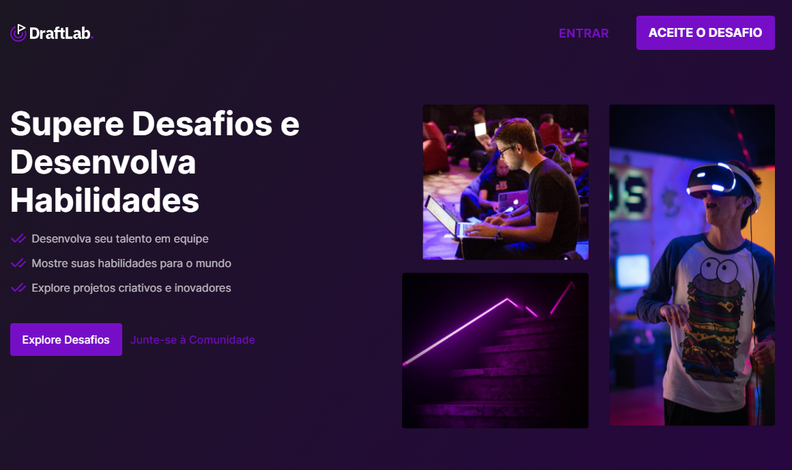

# Galaxy_Solar

<p align="center">
  
</p>

## 💻 Projeto

Projeto de front end para recriar uma Landing Page do site DraftLab. Esse é o desafio do projeto criado pela <a href="https://www.draftcode.tech/">DraftCode</a>, cujo intuito é aprimorar suas skills front-end através de projetos práticos.

## ✨ Tecnologias

- [NextJS](https://nextjs.org/)
- [React](https://reactjs.org)
- [TypeScript](https://www.typescriptlang.org/)
- [Tailwind CSS](https://tailwindcss.com/)

## 🔖 Layout

Você pode visualizar o layout do projeto através [desse link](https://www.figma.com/file/HKJkTvOC5x7vdDDgEtUxnY/DraftLab?type=design&node-id=0-1&mode=design&t=ZPscigOriatqsCbG-0). É necessário ter conta no [Figma](http://figma.com/) para acessá-lo.

## 🚀 Como executar

Clone o projeto e acesse a pasta do mesmo.

```bash
$ git clone https://github.com/ViniciusBussolo1/DraftLab.git
$ cd DraftLab
```

Para iniciá-lo, siga os passos abaixo:

```bash
# Instalar as dependências
$ npm install
# Iniciar o projeto
$ npm run dev
```

O app estará disponível no seu browser pelo endereço  http://localhost:3000/.
